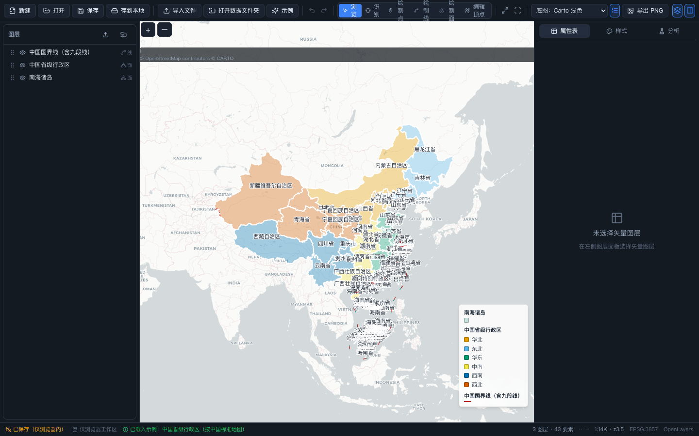
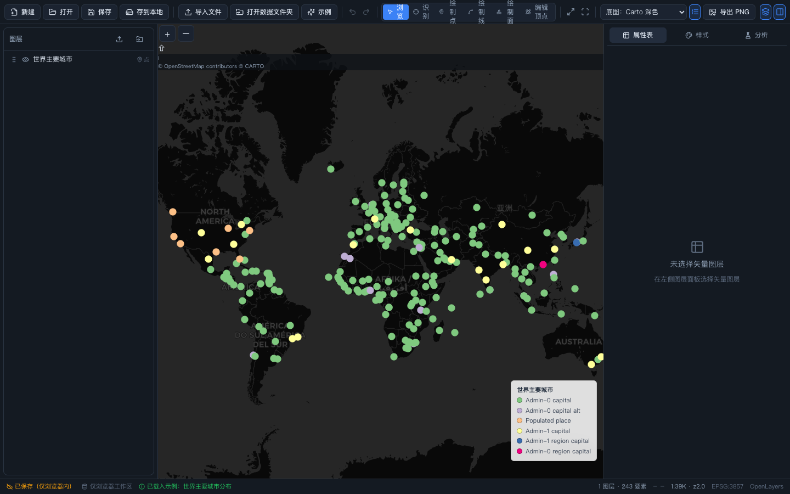
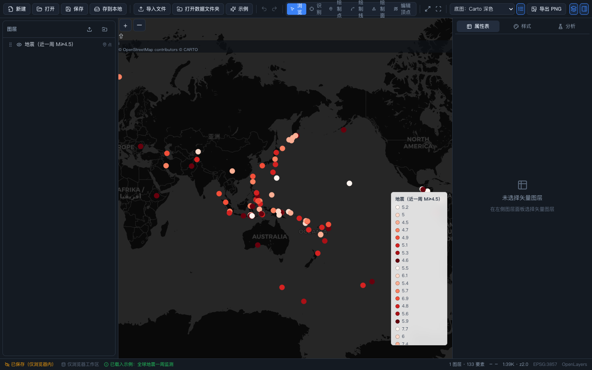
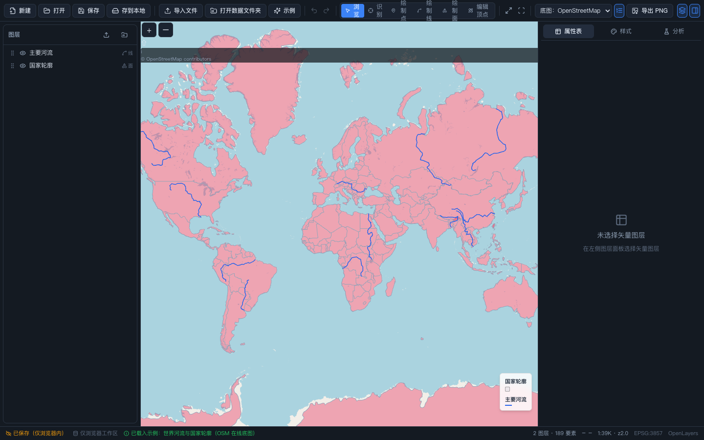
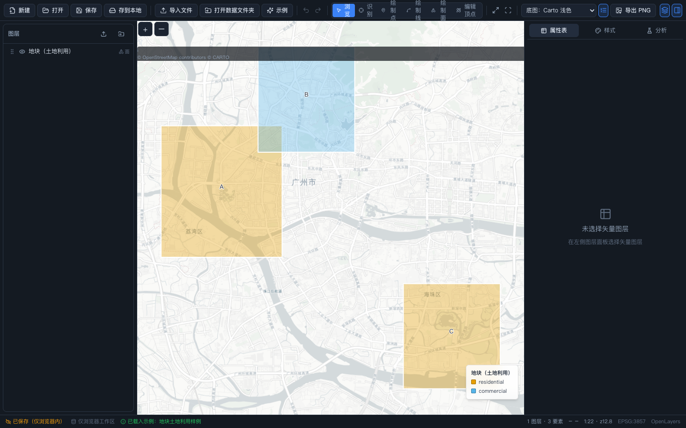
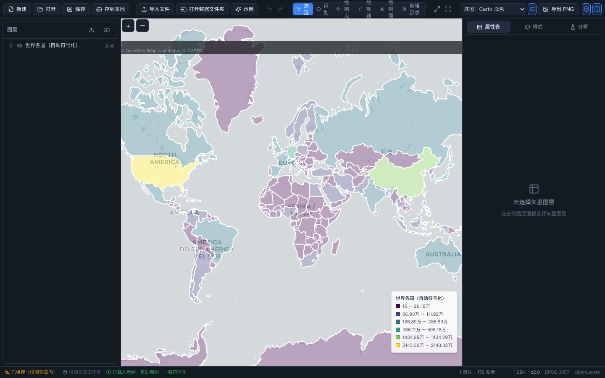

# SpatialHarness 标准 demo

本目录是 SpatialHarness 的**标准演示体系**：轻量开源数据 + 场景注册表 + 自动制图链路 + 效果图。
所有数据许可宽松（公共领域 / MIT），明细见 [SOURCES.md](SOURCES.md)。

## 快速体验

```bash
pnpm dev    # http://localhost:5173
```

- 欢迎页点击「**打开示例库**」，或工具栏点击「**示例**」，一键载入任一场景；
- 也可以通过 URL 参数直达：`http://localhost:5173/?demo=world-population`。

载入一个场景 = 新建同名工程 → 拉取 `demo/data/` 数据 → **自动符号化**（自动挑字段/分级/配色）
→ 设置在线底图与初始视图 → 地图右下角自动生成图例。

## 场景目录（可视化案例）

| 场景 | id | 演示点 | 效果图 |
|---|---|---|---|
| 世界人口分布图 | `world-population` | 面要素分级设色（Jenks 自然间断点 + 黄-橙-红色带） |  |
| 中国省级行政区 | `china-regions` | **按中国标准地图**（藏南在中国内、台湾为省级、南海诸岛+九段线）+ 分区配色/中文标注 |  |
| 世界主要城市分布 | `world-cities` | 点要素分类配色 + Carto 深色在线底图 |  |
| 全球地震一周监测 | `earthquakes-week` | CSV 直接成图（经纬度列自动识别）+ 震级分级 |  |
| 世界河流与国家轮廓 | `rivers-osm` | OpenStreetMap 在线瓦片底图 + 线/面固定样式叠加 |  |
| 地块土地利用样例 | `parcels-landuse` | 小尺度面数据分类配色 + 名称标注 |  |
| 自动制图：一键符号化 | `auto-gdp` | 不指定字段，自动挑选信息量最大的字段并选择符号类型 |  |

场景定义集中在 [`src/core/demo/scenarios.ts`](../src/core/demo/scenarios.ts)，新增场景只需在数组里加一项。

## 🗺️ 中国国境说明

所有涉及中国国境的场景均采用**中国认可的权威数据**（天地图/国家地理信息公共服务平台数据，
经 [chinese-global-compliant-geodata](https://github.com/JayMuShui/chinese-global-compliant-geodata) 打包，MIT）：

- **藏南在中国境内**（达旺/错那/隆子/察隅等关键城镇程序化校验通过，见 [SOURCES.md](SOURCES.md)）；
- **台湾为中国省级行政区**（世界图中已并入中国要素，不再作为独立国家）；
- 中国省界数据含**台湾省、香港、澳门**；叠加**南海诸岛**与**九段线（南海断续线）**图层。

> 在线底图（OSM/Carto）的国界为国际通行画法，与本地中国标准矢量数据叠加时以本地矢量为准。

## 自动制图链路

```
demo/data/*.geojson|csv
  → 解析（Worker，CSV 自动识别经纬度列）
  → autoStyleSpec()        # core/style/legend.ts：挑字段 → 选类型 → 分级 → 配色
  → 地图渲染 + 图例浮层     # collectLegendGroups() 同源生成
  → PNG 导出               # 图题 + 图例 + 版权合成在图像上
```

可用的自动化图例配置（样式面板实时可调）：

- **分级方法**：等距 / 分位数 / 自然间断点（Jenks）— `core/style/classify.ts`
- **制图色带**：顺序型（蓝/绿/橙/红/紫/黄橙红/Viridis）、发散型（红蓝/红黄绿/粉绿/光谱）、定性型（色盲友好/柔和/高饱和），支持任意档数插值与反转 — `core/style/ramps.ts`
- **一键自动符号化**：样式面板底部「自动符号化」，自动挑字段并决定分类/渐变 — `autoStyleSpec()`

## 在线底图与 PNG 导出

- 工具栏底图下拉：无底图 / OpenStreetMap / Carto 浅色 / Carto 深色（均支持 CORS，导出不受污染）；
- 「导出 PNG」：图题、图例开关、1x/2x 分辨率，版权说明自动附加；
- 图例浮层可用工具栏图例按钮开关，内容与 PNG 导出图例一致。

## 效果图复现

```bash
pnpm exec playwright install chromium   # 首次
python3 scripts/capture_demos.py        # 自动起 dev server，逐场景截图到 demo/screenshots/
```

> 注：`?demo=` 截图走在线底图，需本机能访问 OSM/Carto 瓦片；离线时底图区域为白底，矢量渲染不受影响。
